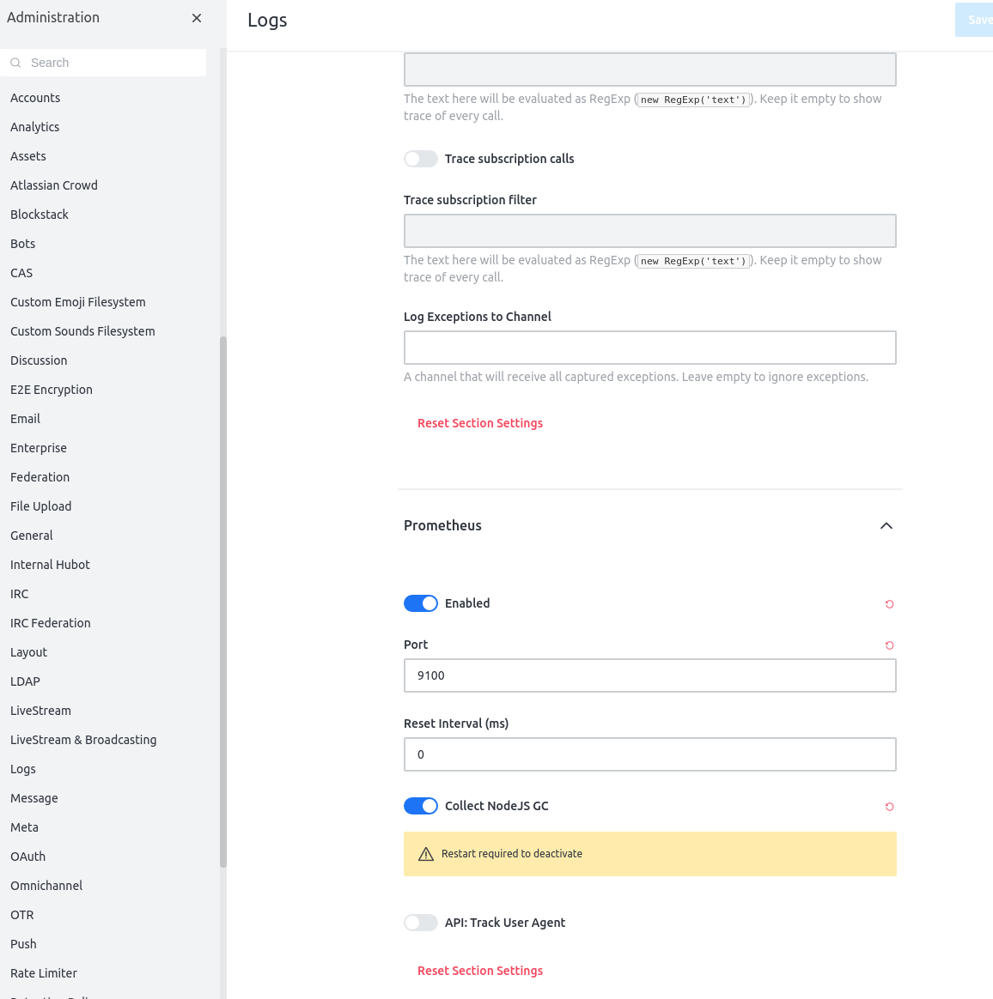
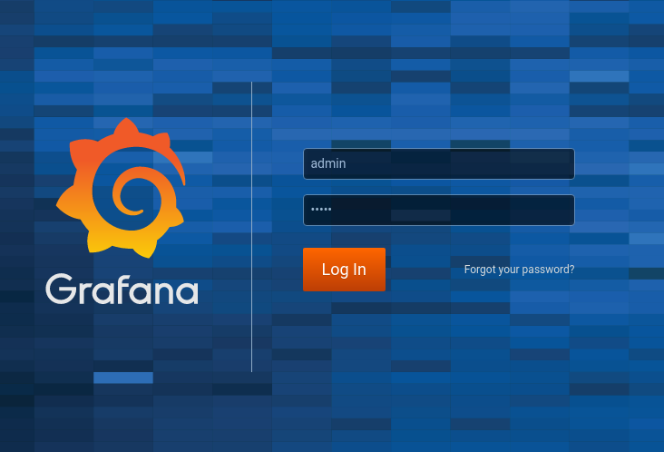
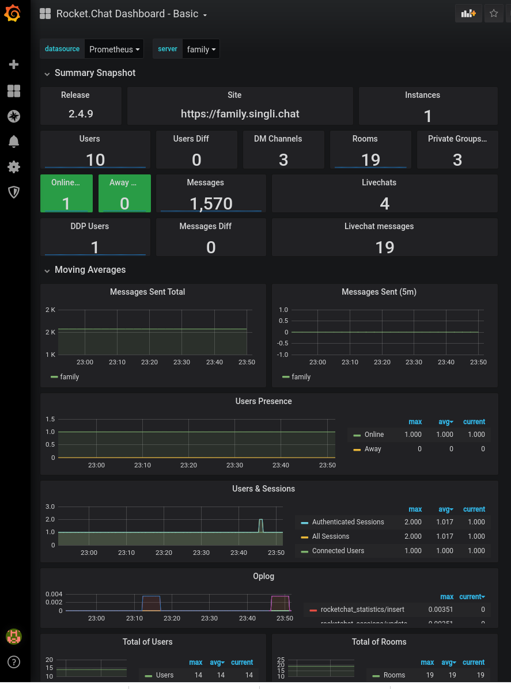
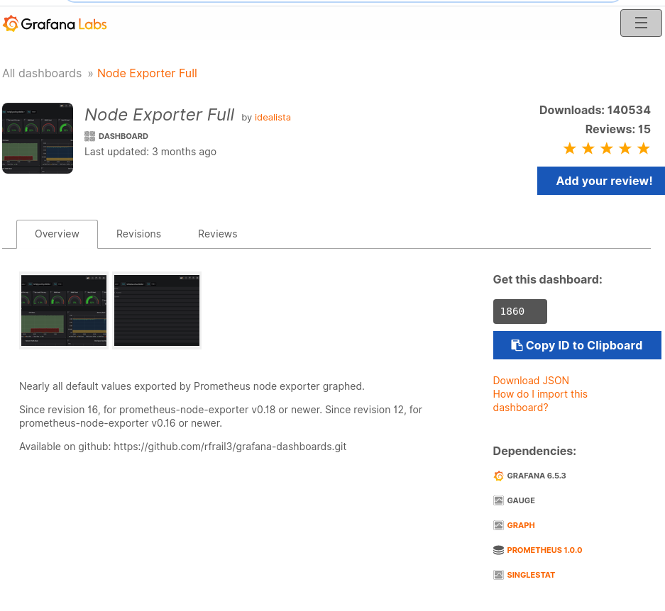
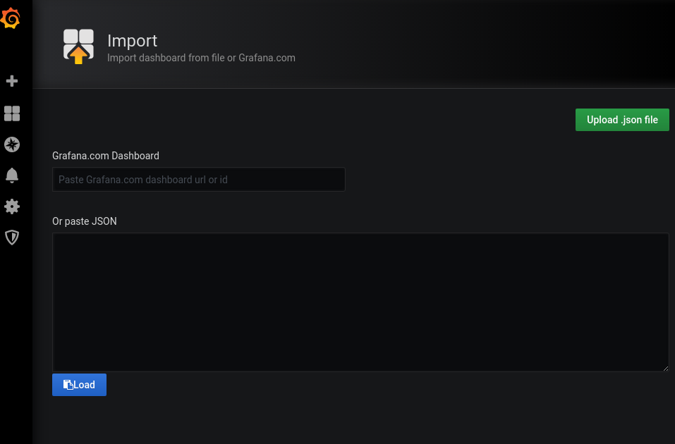
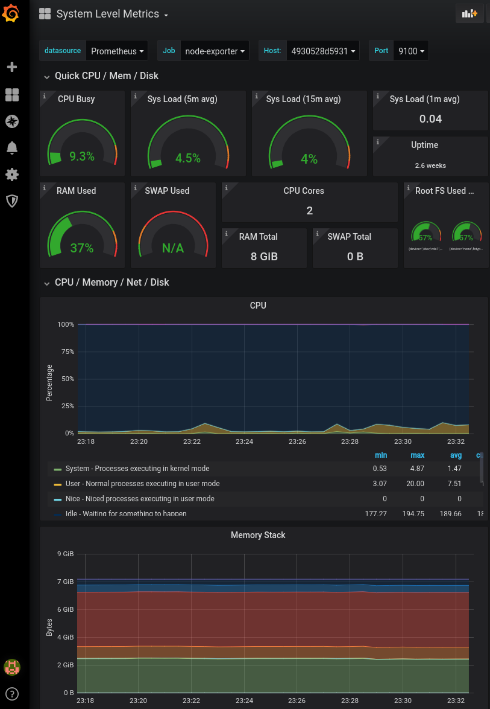

# Rocket.Chat.Monitoring
Easy ad-hoc monitoring of a single or multiple Rocket.Chat servers

## Monitoring your existing server(s)

So you have a few Rocket.Chat servers running for your family and friends, perhaps for your office or special interest group.
You've always wanted some way to "look inside" these servers and monitor their health during operations but fell short of doing something about it.

This project will help you to realize that goal.   It will show you step by step how to setup monitoring for your existing Rocket.Chat server.  

It is assumed that you may have deployed your running Rocket.Chat servers using manual or docker or snap methods.   The "monitoring tools" and "stack" will be deployed via docker-compose.

This is a manual, ad-hoc, setup for Rocket.Chat server(s) running on one single machine/VM/VPS/swarm.  If you are clustered and/or are already using orchestration platforms such as Kubernetes, this project will not be useful for you. 

The monitoring stack used in this project is adaptive to all platforms and can easily run even on a Raspberry Pi 4 - 4GB.

###  Pre-requisites

*  the latest supported docker and docker-compose installed and working for your platform (on Ubuntu 18.04 LTS and later, `snap install docker` )

### Step by Step

#### 1.  Prepare your Rocket.Chat servers to expose metrics

For security reasons, Rocket.Chat servers do not expose any operational metrics by default.  You must turn it on. 

For each server you want to monitor, sign in as administrator and then go to **Administration -> Logs -> Prometheus** and make sure you **enable** it and remember the default port used.  Save your changes.



#### 2.   Create monitoring network and add server containers (for docker deployed servers)

If your server(s) are deployed using docker on your multi-cores machine/vps, then create a monitoring network:

```
docker network create monitoring
```

And then connect the server(s) that you want to be monitored to this network, issuing this command for each running server container:

```
docker network connect monitoring <<container name>>
```

Where ``<<container name>>`` is the name or id of the container currently running Rocket.Chat.

Once you've added all your server containers to the monitoring network, confirm it using:

```
docker network inspect monitoring
```

You should see all your containers listed as connected to monitoring network.  

Alternatively, if you have your Rocket Chat docker containers run on a network that you can safely expose, just change this section the docker-compose.yml for your Rocket Chat instance:

from:
```
    ports:
      - 3000:3000
```

to 
```
    ports:
      - 3000:3000
      - 9100:9100
```

Either way, you can now confirm that every one of your Rocket.Chat servers is now exposing metrics:
Confirm that everyone of your Rocket.Chat server is now exposing metrics:


```
curl http://<your server's (container's) ip address>: port
```

Use either the server's IPv4 or the containers IPv4 address, and the port that you noted in step 1.   You should see a page of metrics in text format.   

#### 3.   Setup Prometheus to scrape metrics from servers and store data

We are using industry de-facto standard monitoring solution, open source [prometheus](https://prometheus.io/), to collect and store the metrics.  

First, clone this repository:

```
git clone https://github.com/Sing-Li/Rocket.Chat.Monitoring
```

Next, you need to tell prometheus how to find your Rocket.Chat servers.  prometheus will periodically reach out to each server and "scrape" the metrics.   This configuration is done in the `prometheus.yml`  YAML configuration file.


```
cd   Rocket.Chat.Monitoring/prometheus/config
vi prometheus.yml
```

Every one of the server that you want to monitor has a `job` section under `scrape_configs` within the file.

For every server container you added in step 2, you should add a dns_sd (Naming service discovery) job:

```
     - job_name: <short server name>
       dns_sd_configs:
       - names: ["<actual container name or id>"]
         type: A
         port: <port exposing metrics>
```

The `<short server name>` should be a unique string to identify the server to be scraped (for example `familyserver`).   The `<actual container name or id>`  must be the name or id of a container that you have confirmed to be connected to the monitoring network in step 3.    The `<port exposing metrics>` is the port that you've noted in step 1 and verified at step 2.


For every server that you want to monitor, but is not running in docker, or not connected to the monitoring network, use a `static_configs` job description:

```
     - job_name: <short server name>
       static_configs:
         - targets: ['<IP address of server host>:<port exposing mettrics']
```

The `<short server name>` should be a unique string to identify the server to be scraped (for example `familyserver`).   The `<IP address of server host>`  must be the IP address that you can reach the server to be monitored by.  The `<port exposing metrics>` is the port that you've noted in step 1.

After you've add `scrape_configs` for every one of the servers to be monitored, save the YAML file changes. 

Next, you can now create a persistent storage volume for the prometheus container to use for data storage.

```
   docker volume create prom-storage
```


You can then start the prometheus container.   Make sure you're in the `prometheus` subdirectory where you will find the `docker-compose.yml` file.   Then start prometheus by:

```
docker-compose up -d
```

This should start prometheus scraping your servers immediately.   Check the logs to make sure it did not crash or fail.  Typical reason for failure is problem parsing your `prometheus.yml` file.


```
docker logs <prometheus container name or id>
```

 If everything is working well, the last line in the log should have a message similar to:
 
 ```
"Server is ready to receive web requests."

```

At this point, the prometheus web UI is available on your host at port 9091 (configurable in the `docker-compose.yml` file).  Point a browser to the web UI at:

```
http://<host IP of prometheus container>:9091/targets
```

You should see your list of server scraping`jobs` and their status.  If any of them do not report **UP** status, double check the `promethus.yml` and restart the container.

Here is the web UI of a working prometheus scraper, handling 4 servers.


At this point, you may want to experiment with the Prometheus web UI and become familiar with PromQL.   This will become more important when you need to design and customize your own monitoring system and dashboard.  See [Prometheus documentation](https://prometheus.io/docs/introduction/overview/) for more information.

Before you move onto the next step of setting up graphical dashboards, you may want to close up the web UI port currently exposed on the host machine (this can become a security problem if your machine is exposed to the Internet).   You can do this by removing the port mapping in the `docker-compose.yml` file and recreate the prometheus container.

#### 4.   Setup grafana to display graphical dashboards based on collected data

You will use [grafana](https://grafana.com/), the open source de-facto visualization platform that works extremely well with prometheus, to display your dashboards (as well as creation of new dashboards and customization of existing ones).   

Grafana will be running in a docker container that is connected to the monitoring network that you setup previously  (prometheus should be now running and connected to this monitoring network from step 3).

First thing you need to do is to create a persistent storage volume for the grafana container to use for data storage.

```
   docker volume create grafana-storage
```
If you have been following these instructions, there will not be any need to modify the grafana container's configuration for connection to prometheus, it should **just work**.  However, if you have deviated, the configuration file to connect prometheus as a datasource is at `grafana/provisioning/datasources/prometheus.yml` and you can modify it to suit your networking topology.  See [grafana documentation](https://grafana.com/docs/grafana/latest/features/datasources/prometheus/) for details.

```
apiVersion: 1

datasources:
- name: Prometheus
  type: prometheus
  access: proxy
  url: http://prometheus:9090
  version: 1
  editable: false

```

The monitoring network you created earlier has a naming service that will resolve the name `prometheus` for the connection between grafana and prometheus.

To start the grafana container running, make sure you're in the `granfana` directory where the `docker-compose.yml` YAML file is located, then start the server.


```
docker-compose up -d
```

Grafana should be up and running now, double check the logs.

```
docker logs <grafana container name or id>
```

If everything goes well, you should see a message indicating the server is listenting to requests.

```
"HTTP Server Listen"
```

If you see connection problems, double check the grafana datasource YAML file `prometheus.yml` and restart the container.

Point your browser to access the grafana login at:


```
http://<host IP of grafana container>:3037
```



The default login credential is:

```
username:   admin
password:   admin
```
You should immediately add users and change the administrator's password.   See [grafana permissions and roles](https://grafana.com/docs/grafana/latest/permissions/overview/)  for more information on user administration and setup.

Upon login, you can immediately import the starter Rocket.Chat dashboard and get a real-time look inside your Rocket.Chat server(s).   Move your mouse over the bit **+** on the left bar and select *import*.


Choose **Upload .json file**.  Select the dashboard `.json` file from `dashboards/rocketchat/rcmonitoringbase.json`.   This will load and display the dashboard against the prometheus data.   



From the **server:** drop down list, you can select any of your servers to display its metrics.

This is only a basic "starter" dashboard that we included. It has many of the useful Rocket.Chat application level metrics, API call and resource consumption metrics, and NodeJS based metrics.    

You are likely only to need a subset of the panels on the dashboards and can customize it to your needs.   You are encouraged to study the [grafana dashboard design documentation](https://grafana.com/docs/grafana/latest/features/dashboard/dashboards/) and customize or create your own.   Please consider contributing any useful dashboards that you create back to this project.

#### 5.   (optional) Setup system level monitoring with node exporter and grafana

One frequently requested addition to Rocket.Chat's application level monitoring is the ability to monitor the system that is hosting the server itself.   Namely to visualize the underlying CPU usage, memory consumption, disk usage, network traffic and so on.   

This obviously will require operating system level access to extract the metrics. And the data collected is pertained to the  entire physical-machine/vm/vps that may be running many Rocket.Chat containers/instances, prometheus and grafana, and other services/tasks. 

Thankfully, prometheus has created an open source [node exporter](https://github.com/prometheus/node_exporter) that will directly access the linux system (via mechanisms such as [procfs](https://www.kernel.org/doc/Documentation/filesystems/proc.txt) ) and convert the information in realtime to prometheus compatible metrics.   These system metrics can then be visualized on grafana dashboards.  

With the work you've already completed in step 1 to 4, it is very easy to add node exporter to the data collectors mix.  You can start node-exporter collecting data, on the machine/vm/vps that you want to collect data on, by going to the `nodeexporter` directory and running the `docker-compose.yml` there.

```
sudo docker-compose up -d
```

It is necessary to run node-exporter as superuser to access some of the stats provided by its plugin _system collectors_. You can, however, opt to run it without superuser privileges and still obtain most of the CPU, memory, disk and publicly accessible metrics.

Check the logs immediately.  If everything works fine, you should see a message similar to.

```
msg="Listening on" address=:9100

```

You can also see the converted prometheus compatible metrics.

```
curl  http://<host where node exporter is running>:9100 
```

At this point, you will want to close up port 9100 by removing it from the `docker-compose.yml` and restarting the node exporter container.

Next, you need to tell prometheus about this additional service to scrape.   You can do this by adding a `job` to the `scrape_configs` section in the `prometheus/config/prometheus.yml` file and then restarting the prometheus container. 

```
scrape_configs:

  - job_name: <short name of the physical machine or vm or vps>
    dns_sd_configs:
    - names: [<name or id of node exporter container>]
      type: A
      port: 9100

```
Here we assumed that you have setup the local monitoring network as detailed in the previous steps and used a naming service config.  If your networking topology differs, you will have to hardwire the ip address in a job with a static config.  If you are scraping across a physical network, you may want to add more jobs to scrape the different physical-machines/vms/vps hosting the Rocket.Chat servers.

After restarting the promethus container.  You can setup grafana to display the data.   

This time, you will obtain a pre-fabricated ready-to-go dashboard shared by the grafana community for displaying the node exporter metrics.   Visit the [grafana dashboards repository](https://grafana.com/grafana/dashboards) to see the hundreds of community contributed (and official) dashboards available.

  

The dashboard you will use is the [classic node exporter full dashboard by idealista](https://grafana.com/grafana/dashboards/1860).   It has a full mapping of node exporter metrics in its panels, and is an ideal base to customize for your own needs.  Note the unique dashboard id, in this case `1860`.   Grafana can directly import dashboards from this public repository via the dashboard id.

Login to grafana, click the **+** button and select import again.

 

Enter the dashboard id `1860`, wait for the dashboard information to be fetched by grafana.

Then select your prometheus data source and click **Import**.

The dashboard should start immediately displaying the system metrics from your machine/vm/vps.  In the **job** drop down list,  you can select to monitor the different physical-machines/vms/vps you are monitoring  (assuming you have setup multiple jobs earlier). 



#### 6.   (optional) Setup docker container level monitoring with cadvisor

This next optional step is to add container level monitoring metrics via [Google's cadvisor](https://github.com/google/cadvisor).  

See `cadvisor/docker-compose.yml` for the conifguration.   Note that this configuration is for docker installed via snap. 

If you installed docker directly on your system, you will need to modify one of the `volume` mappings:

```
"/var/lib/docker:/var/lib/docker:ro"
```

You can now start cadvisor running:

```
docker-compose up -d
```
Check for cadvisor exposing a page of metrics:

```
curl   https://<hostname or ip of host where cadvisor is running>:8088/metrics
```

Next, you need to add a scrape job for prometheus in the `prometheus/config/prometheus.yml` file.  Here, we will assume you have the monitoring network setup with naming service available. You can, of course, use static configs for your own network instead.

```
scrape_configs:

  - job_name: <meaningful name for this server level scrape job>
    dns_sd_configs:
    - names: [<name or id of cadivisor container>]
      type: A
      port: 8080
```

After saving the scape configuration, restart the prometheus container.

In the `prometheus` directory.

```
docker-compose down

docker-compose up -d
```

At this point, you can login to grafana, and import the [Docker monitoring with node selection](https://grafana.com/grafana/dashboards/8321) dashboard by Nazar; its id is `8321`.  

Refresh grafana, and you should see the metrics start to display for all your running containers.


